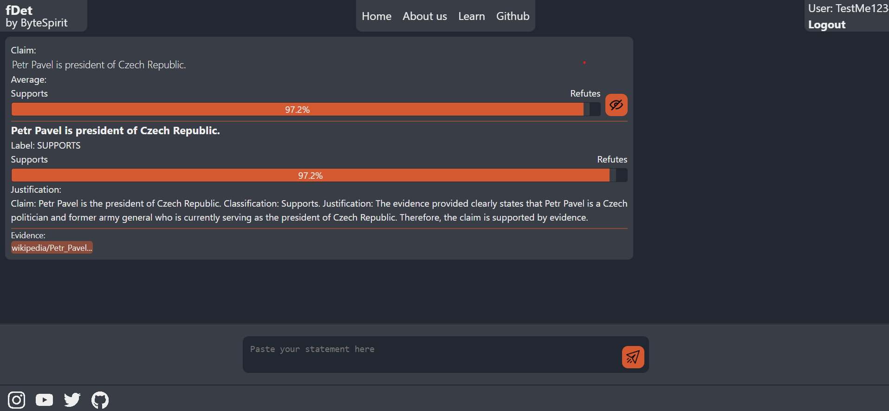

# fDet

fDet is a website application for fake-news detection using modified RoBerta AI and GPT 3.5 Turbo. It combines the power of these AI models to provide accurate detection of fake news.

## Getting Started

To set up the project locally, follow these instructions:

### Virtual Environment

Create a virtual environment and activate it using the following commands:
```cmd
~\AppData\Local\Programs\Python\Python39\python -m venv venv
venv\Scripts\activate
```


###  Install Python Dependencies
Install the required Python packages using the requirements.txt file:
```cmd
pip install -r requirements.txt
```


### Run Django
To run the Django server, execute the following commands:
```cmd
cd ./frontend
python manage.py runserver
cd ../
```

### Run FastAPI

To run the FastAPI server, execute the following commands:
```cmd
cd ./backend
python api.py
cd ../
```
### Star History
[](https://star-history.com/#ByteSpiritGit/fdet&Date)


### Screenshots


*Screenshot 1: Example of fDet website index page.*


*Screenshot 2: Another example of fDet website interface.*
